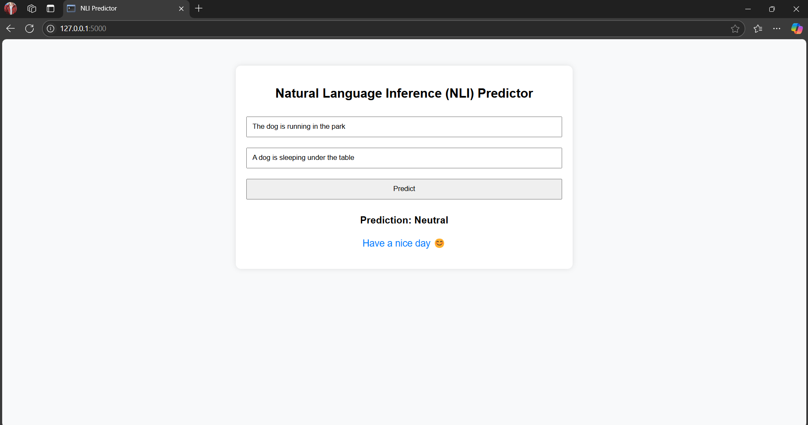
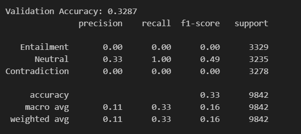
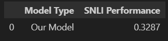

# lab4_NLP

## Task 1: 
### Dataset Description

The dataset used for training BERT in this notebook is a subset of the Wikipedia dataset. The Wikipedia dataset is a large-scale dataset containing text from Wikipedia articles. It is commonly used for natural language processing (NLP) tasks, including language modeling and pre-training of transformer models like BERT.

### Dataset Source

The Wikipedia dataset is sourced from Hugging Face's datasets library. Hugging Face provides a wide range of datasets for various NLP tasks, and the Wikipedia dataset is one of the most popular datasets for pre-training language models.

[Wikipedia Dataset on Hugging Face](https://huggingface.co/datasets/legacy-datasets/wikipedia)

## Task 3:

## Challenges

- **Small Batch Size**: Leads to noisy gradient updates and slower convergence.
- **Limited Training Epochs**: One epoch restricts generalization.
- **Dataset Imbalance**: Unequal class distribution may impact learning.

## Improvements

- **Hyperparameter Tuning**: Adjust learning rates, batch sizes, and optimizers.
- **Larger Model**: Using BERT-base-uncased for better representations.
- **More Training Epochs**: Fine-tuning longer with learning rate scheduling.
- **Addressing Imbalance**: Oversampling or data augmentation.
- **Enhanced Representations**: Using CLS token or self-attention instead of mean pooling.

## Discussion

Due to the large size of the dataset and the limited time available for training, the results may not be as good as expected. Training large models like BERT on extensive datasets requires significant computational resources and time. When training time is constrained, the model may not fully converge, leading to suboptimal performance. Additionally, the limited number of training epochs can restrict the model's ability to generalize well to unseen data. Some ways to mitigate these issues:

- **Incremental Training**: Train the model incrementally over multiple sessions, saving checkpoints and resuming training later.
- **Data Subsampling**: Use a smaller, representative subset of the dataset for initial experiments to reduce training time.
- **Efficient Training Techniques**: Implement techniques like mixed-precision training and gradient accumulation to make better use of available resources.
- **Cloud Resources**: Utilize cloud-based GPU/TPU resources for faster training and better scalability.